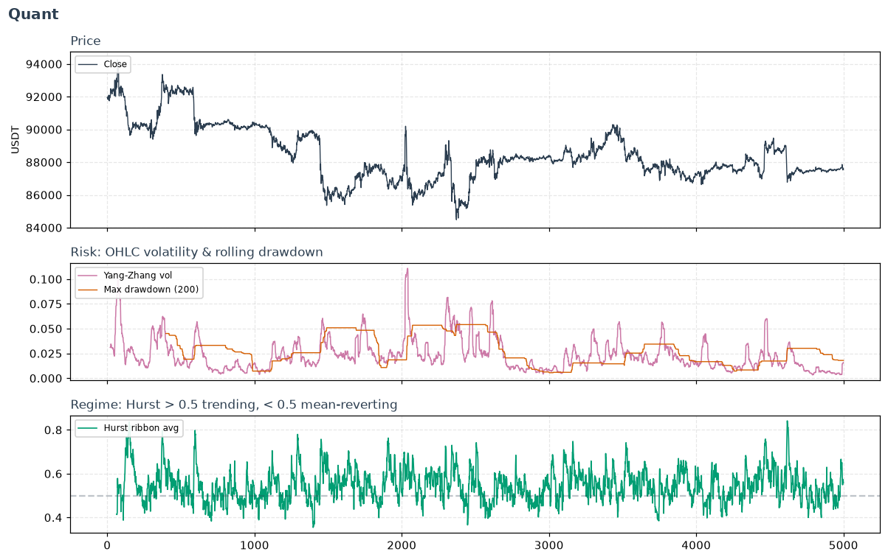

# Quant

The professional-desk layer: volatility *forecasting*, risk sizing, regime
detection, and factor construction. Where the retail indicators help you *read a
chart*, these help you *size a position*, *decide which strategy family fits the
current regime*, and *build a cross-sectional book*. Most are validated against
real BTCUSDT market data rather than synthetic noise.

## Volatility estimators

More accurate volatility than close-to-close, by using the whole OHLC bar. Each
squeezes more information from the same data, trading off different
assumptions:

- **`historical_volatility`** —
  close-to-close baseline.
- **`parkinson_volatility`** — uses the
  high-low range; far more efficient, but assumes no drift or gaps.
- **`garman_klass_volatility`** —
  adds open/close to the range.
- **`rogers_satchell_volatility`**
  — unbiased under drift.
- **`yang_zhang_volatility`** — the
  desk favourite: handles both overnight gaps *and* drift. **Reach for this when
  you have OHLC bars.**
- **`ewma_volatility`** — RiskMetrics-style
  exponential weighting, so a vol spike shows immediately and fades smoothly
  instead of dropping off a cliff `window` bars later.

## Risk-adjusted performance & tail risk

For **position sizing** — lean out as the tail fattens, not just as symmetric
vol rises:

- **`rolling_sharpe_ratio` /
  `rolling_sortino_ratio`** — return per
  unit of total / *downside* volatility.
- **`rolling_cvar`** — Conditional VaR / expected
  shortfall: the average of the worst `α` losses. A *coherent* risk measure
  (unlike VaR), and the natural sizing denominator.
- **`cornish_fisher_var`** — VaR corrected
  for skew and fat tails, so it doesn't understate crash risk the way Gaussian
  VaR does.
- **`rolling_max_drawdown` /
  `calmar_ratio`** — worst peak-to-trough pain,
  and return earned per unit of it.

## Distribution shape (regime fragility)

Higher moments turn *before* volatility does when a market becomes crash-prone:

- **`rolling_skew` /
  `rolling_kurtosis`** — asymmetry and
  fat-tailedness.
- **`jarque_bera`** — one number summarising how
  non-Gaussian returns have been (rises when either tail asymmetry or fat tails
  appear).
- **`gain_to_pain`** — net move per unit of
  downside suffered; a robustness/smoothness screen.

## Regime detection & signal conditioning

Decide *which strategy family* fits now, and make features usable:

- **`hurst_ribbon`** — multi-scale Hurst
  exponent: trending (>0.5) vs. mean-reverting (<0.5) regime, at several
  horizons at once.
- **`regime_conditional_signal`** —
  a hard switch between two pre-built signals based on any regime score (e.g.
  trend-follow when Hurst says persistent, mean-revert otherwise).
- **`frac_diff`** — fractional differentiation
  (López de Prado): make a series stationary while keeping most of its memory —
  often the difference between a feature that predicts and a return series that
  doesn't.
- **`rolling_autocorr` /
  `rolling_ic`** — serial structure, and a
  feature's decaying predictive power (the IC is forward-looking — a *monitoring*
  diagnostic, never a live input).
- **`rolling_z_score` /
  `vol_adjusted_momentum` /
  `volatility_z_score` /
  `relative_volume`** — standardised /
  vol-scaled building blocks for gating and sizing.

## Cross-sectional / factor plumbing

For a **multi-asset book**: compare symbols against each other, and against a
benchmark. Apply the cross-sectional ones with `.over("timestamp")` on a
long-format frame.

- **`cross_sectional_zscore` /
  `cross_sectional_rank`** — rank symbols
  at each instant (the core of a factor strategy).
- **`momentum_12_1`** — the canonical
  Jegadeesh-Titman momentum factor (skip the last month to drop short-term
  reversal).
- **`rolling_beta_to` /
  `downside_beta`** — sensitivity to a
  benchmark, overall and in *down* markets (tail hedging).
- **`idiosyncratic_vol`** — the
  asset-specific risk a beta hedge leaves behind.
- **`amihud_illiquidity` /
  `micro_price_proxy`** — price impact per
  dollar traded, and a volume-tilted fair-price proxy.

---

::: polars_ta.quant
