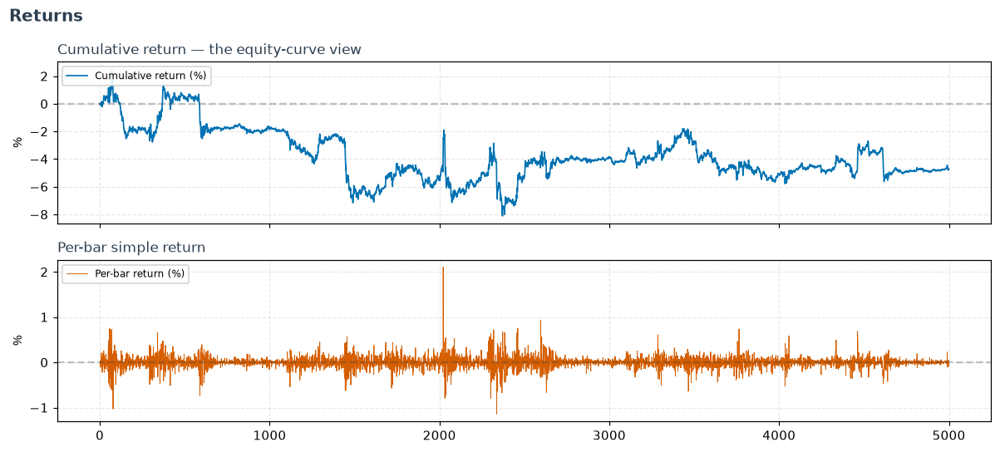

# Returns

The plumbing every other calculation sits on: turning a price series into
returns. Small on purpose — but getting the convention right (percent vs. log,
period vs. cumulative) matters, because everything downstream inherits it.

- **`daily_return`** — simple percentage return
  bar-to-bar. Intuitive; what a P&L statement shows.
- **`daily_log_return`** — the log return.
  Log returns *add up over time* and are closer to normally distributed, which
  is why volatility and risk models are usually built on them.
- **`cumulative_return`** — total growth
  since the first bar; the equity-curve view.

!!! note "Which return should I use?"
    Use **log** returns for anything statistical (volatility, correlation,
    factor models — they're time-additive), and **simple** returns when you need
    an actual P&L or want to compound across assets in a portfolio.

---

::: polars_ta.others
