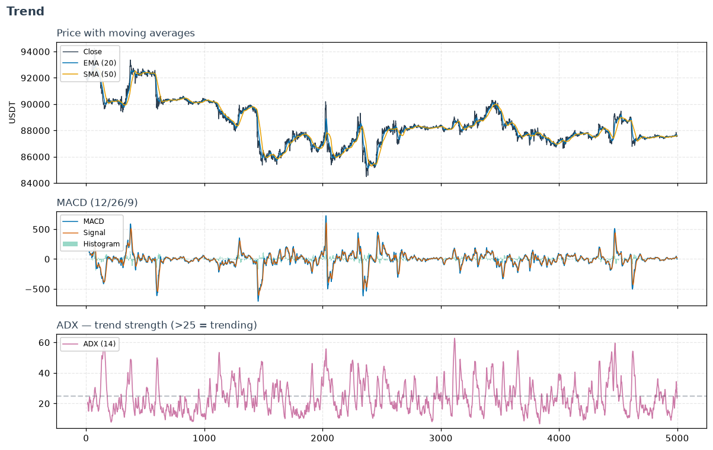

# Trend

**Trend indicators answer: which way is price heading, and how strongly?**
Where [momentum](momentum.md) measures speed, trend tools estimate *direction
and persistence* — the smoothed path, its slope, and whether a directional move
is worth following or is just noise.

## Moving averages — the building blocks

- **`sma_indicator`** — the plain average;
  simple, laggy.
- **`ema_indicator`** — weights recent bars
  more, so it turns faster than the SMA.
- **`wma_indicator` /
  `hull_moving_average`** — the WMA and
  the Hull MA cut lag further; the Hull is the smoothest-yet-responsive of the
  set.

## Direction & strength

- **`macd` / `macd_signal` /
  `macd_diff`** — the workhorse: the gap between a
  fast and slow EMA (line), its own EMA (signal), and their difference
  (histogram, an early momentum-of-trend read).
- **`adx` + `adx_pos` /
  `adx_neg`** — ADX measures trend *strength*
  regardless of direction; the ±DI pair supplies the direction. **The single
  best "should I even be trend-following right now?" gate.**
- **`aroon_up` /
  `aroon_down`** — how recently the window's high
  / low was set; a clean way to detect the *start* of a new trend.
- **`vortex_indicator_pos` /
  `vortex_indicator_neg`** — trend
  direction from the relationship between consecutive highs and lows.

## Trend-following systems & filters

- **`psar`** — Parabolic SAR: a trailing stop-and-reverse
  dot that also marks the trend side.
- **`supertrend`** — an ATR-banded trend line; a
  popular, readable stop/entry rail.
- **`ichimoku_a` /
  `ichimoku_b` and the conversion/base lines** —
  a whole trend-and-support system in one overlay (the "cloud").
- **`cci` / `trix` /
  `dpo` / `kst` /
  `stc` / `mass_index`** —
  oscillator-style trend measures: deviation from the mean (CCI), triple-smoothed
  rate of change (TRIX), a detrended price cycle (DPO), a summed
  multi-timeframe momentum (KST), a Schaff cycle (STC), and a range-expansion
  reversal warning (Mass Index).
- **`elder_bull_power` /
  `elder_bear_power`** — how far buyers /
  sellers push price beyond a baseline EMA.

!!! tip "Gate momentum with trend strength"
    A classic combination: use `adx` to decide *whether*
    the market is trending, then follow `macd` when it
    is and fade a [momentum](momentum.md) oscillator when it isn't. See the
    [regime-conditional switch](../how_to_guides.md#regime-conditional-trendmean-reversion-switch).

---

::: polars_ta.trend
