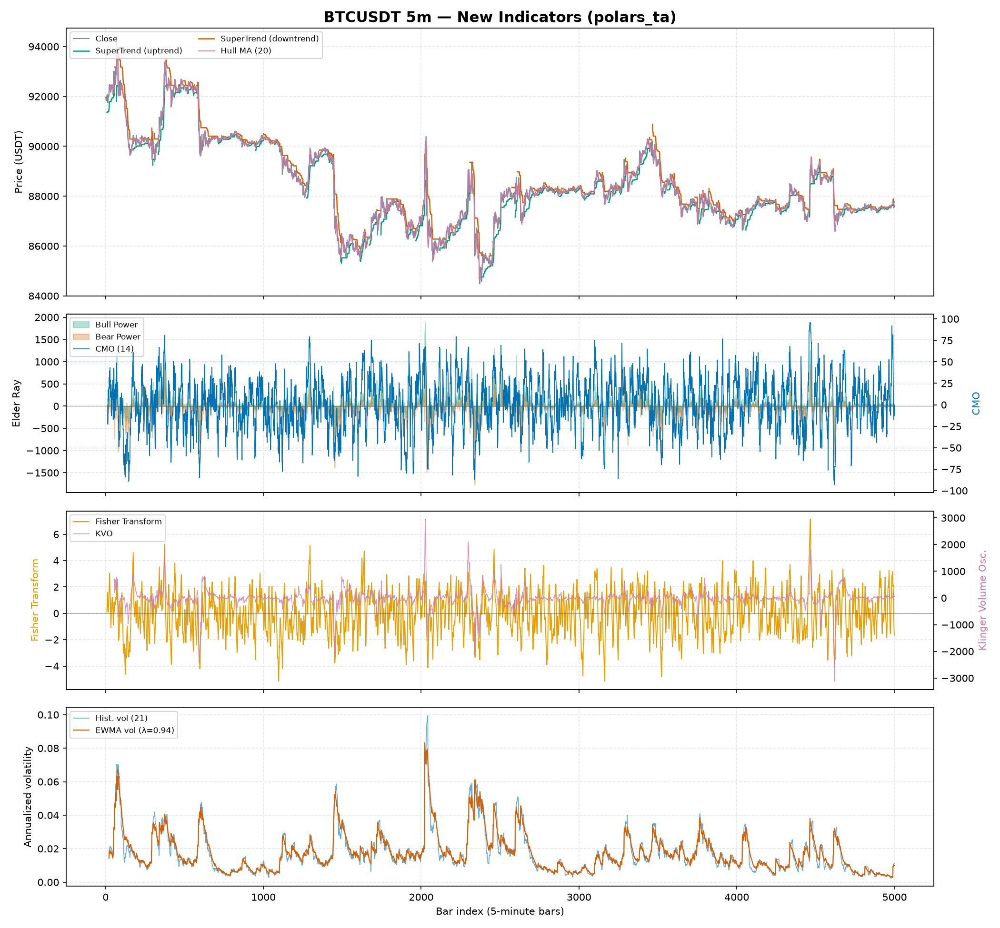
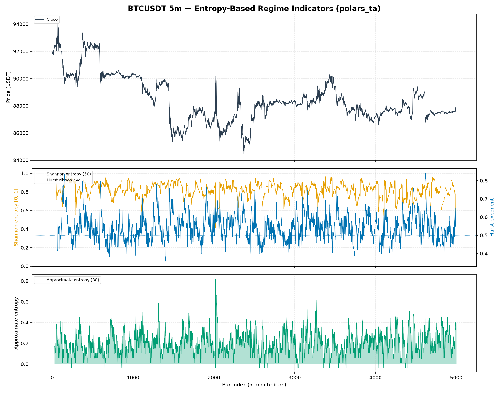
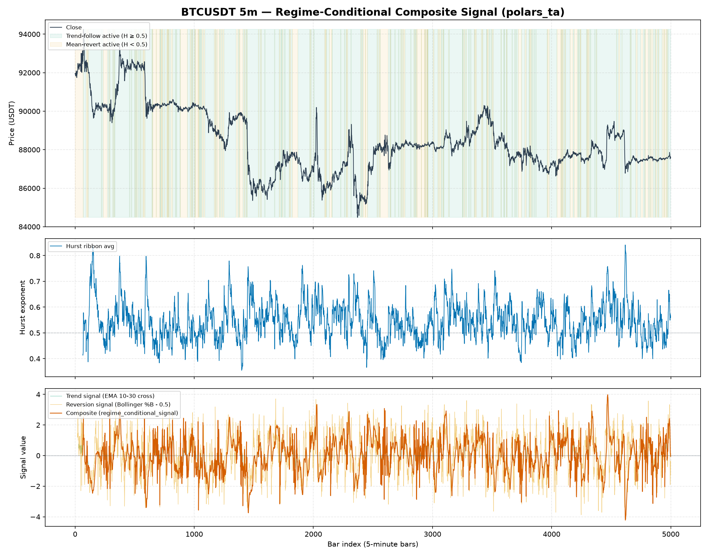

# Examples

!!! tip "Regenerating the figures"
    Every figure on this page is produced by a script in `examples/` and
    committed to `docs/assets/`. Regenerate them all at once with
    `uv run python examples/generate_all_figures.py` after changing an indicator.

## Quickstart: a full indicator bundle

The runnable version of this lives at [`examples/quickstart.py`](https://github.com/Dante-Berth/Polars_TA/blob/main/examples/quickstart.py):

```python
--8<-- "examples/quickstart.py"
```

Run it with:

```bash
uv run python examples/quickstart.py
```

## Classic indicators on real BTCUSDT data

[`examples/plot_classic_indicators.py`](https://github.com/Dante-Berth/Polars_TA/blob/main/examples/plot_classic_indicators.py) plots the well-known retail toolkit — Bollinger Bands, RSI, MACD and ATR — on the same 5,000-bar Binance BTCUSDT 5-minute fixture, so you can see the everyday indicators before the professional-desk ones below.

```bash
uv run python examples/plot_classic_indicators.py
```


### Reading the classic panels

**Panel 1 — Price, Bollinger Bands (20, 2) and a 50-bar SMA.** [`volatility.bollinger_hband`/`bollinger_lband`](api/volatility.md#polars_ta.volatility) draw the ±2σ envelope around the 20-bar moving average; price tagging or piercing a band flags a stretched move relative to recent volatility. The orange [`trend.sma_indicator`](api/trend.md#polars_ta.trend.TrendIndicators.sma_indicator) is the slower trend reference.

**Panel 2 — RSI (14).** [`momentum.rsi`](api/momentum.md#polars_ta.momentum) with the conventional 30/70 guides. Excursions above 70 (overbought) and below 30 (oversold) are the classic mean-reversion cues.

**Panel 3 — MACD (12/26/9).** [`trend.macd`](api/trend.md#polars_ta.trend.TrendIndicators.macd), its signal line, and the histogram ([`macd_diff`](api/trend.md#polars_ta.trend.TrendIndicators.macd_diff)). Histogram bars are colored by sign *and* positioned above/below zero, so the momentum cross reads without relying on color.

**Panel 4 — ATR (14).** [`volatility.average_true_range`](api/volatility.md#polars_ta.volatility.VolatilityIndicators.average_true_range), the standard volatility-of-range measure used for stop placement and position sizing.

## Trend & volume toolkit on real BTCUSDT data

[`examples/plot_trend_volume.py`](https://github.com/Dante-Berth/Polars_TA/blob/main/examples/plot_trend_volume.py) plots the trend/volume family on the same fixture.

```bash
uv run python examples/plot_trend_volume.py
```


### Reading the trend & volume panels

**Panel 1 — Price with the Ichimoku cloud.** [`trend.ichimoku_a`/`ichimoku_b`](api/trend.md#polars_ta.trend.TrendIndicators.ichimoku_a) form the "kumo" cloud; price above the cloud is bullish context, below is bearish, and the cloud is shaded green/red by which span leads.

**Panel 2 — ADX (14) with directional indicators.** [`trend.adx`](api/trend.md#polars_ta.trend) measures trend *strength* (values above the dashed 25 line mark a trending market), while [`adx_pos`/`adx_neg`](api/trend.md#polars_ta.trend) (+DI / -DI) give its direction.

**Panel 3 — Aroon oscillator (25).** The difference of [`aroon_up`](api/trend.md#polars_ta.trend.TrendIndicators.aroon_up) and [`aroon_down`](api/trend.md#polars_ta.trend.TrendIndicators.aroon_down), shaded by sign — positive (green) when up-trend momentum dominates, negative (purple) when down-trend does. (The raw up/down lines whip too fast to read over 5,000 bars, so the oscillator is shown instead.)

**Panel 4 — On-Balance Volume.** [`volume.on_balance_volume`](api/volume.md#polars_ta.volume) accumulates signed volume; its slope confirms or diverges from price moves.

## Liquidity & microstructure toolkit on real BTCUSDT data

[`examples/plot_liquidity.py`](https://github.com/Dante-Berth/Polars_TA/blob/main/examples/plot_liquidity.py) visualizes the professional-desk liquidity features on the same fixture.

```bash
uv run python examples/plot_liquidity.py
```


### Reading the liquidity panels

**Panel 1 — Price.** Reference for the three microstructure panels below.

**Panel 2 — Spread estimators.** [`microstructure.roll_spread`](api/microstructure.md#polars_ta.microstructure.roll_spread) (from serial covariance of price changes) versus [`corwin_schultz_spread`](api/microstructure.md#polars_ta.microstructure.corwin_schultz_spread) (from consecutive high-low ranges), both in USDT — Corwin-Schultz is the smoother, more robust estimate on bar data while Roll is noisier and drops out when its covariance premise fails.

**Panel 3 — Kyle's lambda.** [`microstructure.kyle_lambda`](api/microstructure.md#polars_ta.microstructure.kyle_lambda) is price impact per unit of signed order flow — higher means thinner, less liquid conditions where a given order moves price more.

**Panel 4 — Half-life of mean reversion.** [`microstructure.half_life`](api/microstructure.md#polars_ta.microstructure.half_life) from a rolling Ornstein-Uhlenbeck fit: single-digit bars mean fast reversion, and the tall spikes are windows where reversion breaks down and the half-life diverges (the axis is capped at 300 bars so the fast-reverting structure stays legible).

## Professional-desk regime dashboard on real BTCUSDT data

[`examples/plot_regime_dashboard.py`](https://github.com/Dante-Berth/Polars_TA/blob/main/examples/plot_regime_dashboard.py) is a runnable matplotlib example that plots `polars_ta` indicators on **real market data** — a 5,000-row slice of Binance BTCUSDT 5-minute OHLCV bars (`tests/fixtures/btcusdt_5m_sample.arrow`), the same fixture used by `tests/test_quant.py` and `tests/test_microstructure.py`.

```bash
uv run python examples/plot_regime_dashboard.py
```


### Reading the three panels

**Panel 1 — Price.** The raw BTCUSDT close price over the 5,000-bar window, for visual reference against the two panels below.

**Panel 2 — Regime (multi-scale Hurst ribbon).** [`quant.hurst_ribbon("close")`](api/quant.md#polars_ta.quant.hurst_ribbon) computes the Hurst exponent at three window scales (16, 32, 64 bars) and averages them into `h_ribbon_avg`. The chart shades the background **green** where the (smoothed) average sits above 0.5 — a trending/persistent regime where momentum strategies have an edge — and **purple** where it sits below 0.5 — a mean-reverting regime where fading extremes tends to work better. The dashed red line at 0.5 marks the random-walk boundary from the underlying rescaled-range (R/S) theory. Notice how the shading flips back and forth rather than committing to one regime for long stretches — that instability is itself informative: it's a signal that this instrument, at this timeframe, doesn't reward a single fixed strategy family and instead needs regime-adaptive logic (this is exactly why professional desks compute this in real time rather than assuming one regime holds).

**Panel 3 — Volatility and order-flow toxicity.** The orange fill is [`quant.yang_zhang_volatility(...)`](api/quant.md#polars_ta.quant.yang_zhang_volatility), an annualized OHLC volatility estimator that accounts for both overnight gaps and intraday drift (the standard choice on professional vol desks over plain close-to-close historical volatility). The red line is [`microstructure.vpin(...)`](api/microstructure.md#polars_ta.microstructure.vpin) — Volume-Synchronized Probability of Informed Trading — computed on 500-unit volume buckets, averaged over a rolling window of 20 buckets. VPIN spikes tend to lead or coincide with the sharpest volatility spikes (e.g. around bar ~2050 in the plot above), which is the whole point of the metric: it is a **flow-toxicity** early-warning signal, not a directional one — high VPIN says "informed traders are active and liquidity is thin right now," not "price will go up" or "down."

### Why this example uses real data, not synthetic noise

Every other example and most unit tests in this repo use synthetic random-walk OHLCV data, which is fine for checking that an indicator's math is internally consistent (e.g. RSI stays in `[0, 100]`). But microstructure/regime features like VPIN and the Hurst ribbon are specifically about detecting structure that *isn't* present in i.i.d. random-walk noise — a synthetic series would make the regime panel look meaningless (Hurst hovering uselessly close to 0.5 everywhere, VPIN with no real spikes to speak of). Validating and visualizing them against real BTCUSDT data is what actually demonstrates they work as intended.

## New indicators on real BTCUSDT data

[`examples/plot_new_indicators.py`](https://github.com/Dante-Berth/Polars_TA/blob/main/examples/plot_new_indicators.py) plots the newest indicator batch — both retail-standard trend/momentum additions and microstructure/quant additions — on the same 5,000-bar BTCUSDT fixture used above.

```bash
uv run python examples/plot_new_indicators.py
```



### Reading the four panels

**Panel 1 — Price with SuperTrend (10, 3.0) and Hull Moving Average (20).** [`trend.supertrend`](api/trend.md#polars_ta.trend) is an ATR-banded stop-and-reverse line — green while price trades above the band (uptrend/long bias), red while below (downtrend/short bias) — computed with the same stateful `map_batches` band-flip logic as `psar`. [`trend.hull_moving_average`](api/trend.md#polars_ta.trend) (purple) tracks price more tightly than a plain SMA/EMA of the same length, trading a little more whipsaw for much less lag.

**Panel 2 — Elder Ray (Bull/Bear Power) vs. Chande Momentum Oscillator.** [`trend.elder_bull_power`](api/trend.md#polars_ta.trend) and [`trend.elder_bear_power`](api/trend.md#polars_ta.trend) measure how far the high/low reach above/below a 13-bar EMA of close — a positive Bull Power with a rising EMA is the classic Elder buy setup. [`momentum.cmo`](api/momentum.md#polars_ta.momentum.MomentumIndicators.cmo) (blue, right axis) is RSI's less-smoothed cousin: it sums raw up/down moves over the window instead of using Wilder's EMA, so it swings faster and reaches further into the ±100 band.

**Panel 3 — Fisher Transform vs. Klinger Volume Oscillator.** [`momentum.fisher_transform`](api/momentum.md#polars_ta.momentum.MomentumIndicators.fisher_transform) (orange) maps a bounded stochastic-style price position through `atanh`, sharpening turning points into more distinct spikes than a plain oscillator — note it uses Ehlers' original double-EMA-damped recursion, not a one-shot `atanh`, which is what keeps it from saturating at its clip boundary on noisy real data. [`volume.klinger_volume_oscillator`](api/volume.md#polars_ta.volume.VolumeIndicators.klinger_volume_oscillator) (purple, right axis) is a volume-force oscillator that flips sign with the typical-price trend direction — used to confirm whether a price move has real volume backing it.

**Panel 4 — EWMA volatility vs. historical volatility.** [`quant.historical_volatility`](api/quant.md#polars_ta.quant.historical_volatility) (blue) uses a flat rolling window; [`quant.ewma_volatility`](api/quant.md#polars_ta.quant.ewma_volatility) (red) uses RiskMetrics-style exponential decay (λ=0.94), so it reacts to a volatility spike immediately and fades out smoothly instead of dropping off a cliff exactly `window` bars later — visible at every spike in the chart, where the red line leads the blue line up and trails it back down.

Two indicators from this batch don't appear in the figure because they aren't single time-series lines: [`microstructure.lee_ready_trade_sign`](api/microstructure.md#polars_ta.microstructure.lee_ready_trade_sign) classifies each bar as buy/sell/unclassifiable (`+1`/`-1`/`0`) rather than producing a continuous line, and [`quant.cross_sectional_zscore`](api/quant.md#polars_ta.quant.cross_sectional_zscore) / [`quant.cross_sectional_rank`](api/quant.md#polars_ta.quant.cross_sectional_rank) rank symbols against each other at each timestamp on a multi-asset frame — see [How-to guides](how_to_guides.md#rank-symbols-cross-sectionally-at-each-timestamp) for a runnable example of both.

## Entropy-based regime indicators on real BTCUSDT data

[`examples/plot_entropy.py`](https://github.com/Dante-Berth/Polars_TA/blob/main/examples/plot_entropy.py) plots the two entropy-based complexity indicators against the multi-scale Hurst ribbon on the same 5,000-bar BTCUSDT fixture.

```bash
uv run python examples/plot_entropy.py
```



### Reading the three panels

**Panel 1 — Price.** Raw BTCUSDT close, for visual reference against the two panels below.

**Panel 2 — Shannon entropy vs. Hurst ribbon.** [`microstructure.shannon_entropy`](api/microstructure.md#polars_ta.microstructure.shannon_entropy) (orange) bins the window's log returns and measures how uniformly they're spread across bins, normalized to `[0, 1]`. [`quant.hurst_ribbon`](api/quant.md#polars_ta.quant.hurst_ribbon)'s average (blue, right axis) measures *directional persistence* instead. The two disagree on purpose: Shannon entropy stays consistently high here (returns are well-spread across bins most of the time — this is what noisy real crypto data looks like) while the Hurst ribbon still swings between trending and mean-reverting regimes underneath that noise. A high-entropy, high-Hurst bar means "noisy but trending"; a high-entropy, low-Hurst bar means "noisy and choppy" — two very different trading conditions that either signal alone would blur together.

**Panel 3 — Approximate entropy.** [`microstructure.approximate_entropy`](api/microstructure.md#polars_ta.microstructure.approximate_entropy) measures how often short return patterns repeat — low values mean the recent path is more self-similar/predictable, high values mean it isn't. Watch bar ~2050: it spikes sharply, coinciding with the same sharp volatility event visible in the price panel and in the VPIN spike from the [regime dashboard](#professional-desk-regime-dashboard-on-real-btcusdt-data) above — a sudden break in pattern regularity is itself a marker of a regime change, not just elevated volatility.

**A cost note on `approximate_entropy`.** Its rolling window uses the textbook O(window²) pairwise-distance algorithm (no known faster exact form), so it's deliberately run here with a small `window=30` — see its docstring for the tradeoff before increasing it on a large frame.

## Regime-conditional composite signal on real BTCUSDT data

[`examples/plot_regime_conditional_signal.py`](https://github.com/Dante-Berth/Polars_TA/blob/main/examples/plot_regime_conditional_signal.py) is a capstone example: it wires [`quant.regime_conditional_signal`](api/quant.md#polars_ta.quant.regime_conditional_signal) to the existing Hurst ribbon to switch between a trend-following signal and a mean-reversion signal, on the same 5,000-bar BTCUSDT fixture.

```bash
uv run python examples/plot_regime_conditional_signal.py
```



### Reading the three panels

**Panel 1 — Price, shaded by which branch is active.** Green shading marks bars where the Hurst ribbon average is `≥ 0.5` (trend-following signal active); orange marks `< 0.5` (mean-reversion signal active). Notice how often the shading flips — this is the same instability observed in the [regime dashboard](#professional-desk-regime-dashboard-on-real-btcusdt-data) example, and it's exactly the situation this helper is built for: a single fixed strategy would fight itself through these flips, so the composite switches instead.

**Panel 2 — Regime score.** [`quant.hurst_ribbon`](api/quant.md#polars_ta.quant.hurst_ribbon)'s `h_ribbon_avg`, the same regime score used to shade panel 1.

**Panel 3 — The two candidate signals and the composite.** The trend signal (green, mostly hidden under the composite) is an EMA(10)-EMA(30) cross, normalized by ATR so it lands on a comparable scale to the reversion signal (tan) — a Bollinger %B deviation from 0.5, scaled by 4. [`quant.regime_conditional_signal`](api/quant.md#polars_ta.quant.regime_conditional_signal) (red) is the hard row-by-row switch between them: it visibly tracks the trend signal during green-shaded regions and the reversion signal during orange-shaded ones, with a discrete jump exactly at each regime flip rather than a smooth blend.

`regime_conditional_signal` is a compositional building block, not a Hurst-specific helper — swap in any regime score (ADX, Shannon entropy, a volatility z-score) and any two pre-computed signal expressions. See the ["Regime-conditional trend/mean-reversion switch"](how_to_guides.md#regime-conditional-trendmean-reversion-switch) how-to guide for the minimal version of this pattern.

## More indicator combinations

### Trend + volatility regime filter

Combine ADX (trend strength) with Bollinger Band width (volatility) to flag "trending and volatile" periods:

```python
from polars_ta import trend, volatility

out = df.with_columns(
    trend.adx("high", "low", "close").alias("adx"),
    volatility.bollinger_wband("close").alias("bb_width"),
).with_columns(
    ((pl.col("adx") > 25) & (pl.col("bb_width") > pl.col("bb_width").rolling_mean(20)))
    .alias("trending_and_volatile")
)
```

### Volume-confirmed momentum

Require both RSI momentum and Money Flow Index (volume-weighted RSI-analogue) to agree:

```python
from polars_ta import momentum, volume

out = df.with_columns(
    momentum.rsi("close").alias("rsi"),
    volume.money_flow_index("high", "low", "close", "volume").alias("mfi"),
).with_columns(
    ((pl.col("rsi") > 70) & (pl.col("mfi") > 80)).alias("overbought_confirmed")
)
```

### Liquidity-aware execution gate

Combine Kyle's lambda (price impact) with VPIN (flow toxicity) to flag conditions where a large order is likely to move the market and get adversely selected — a real pre-trade check used by execution desks before sizing an order:

```python
from polars_ta import microstructure as ms

out = df.with_columns(
    ms.kyle_lambda("close", "volume").alias("kyle_lambda"),
    ms.vpin("close", "volume", bucket_size=500, window=20).alias("vpin"),
).with_columns(
    (
        (pl.col("kyle_lambda") > pl.col("kyle_lambda").rolling_mean(200) * 1.5)
        & (pl.col("vpin") > 0.4)
    ).alias("thin_and_toxic")
)
```
