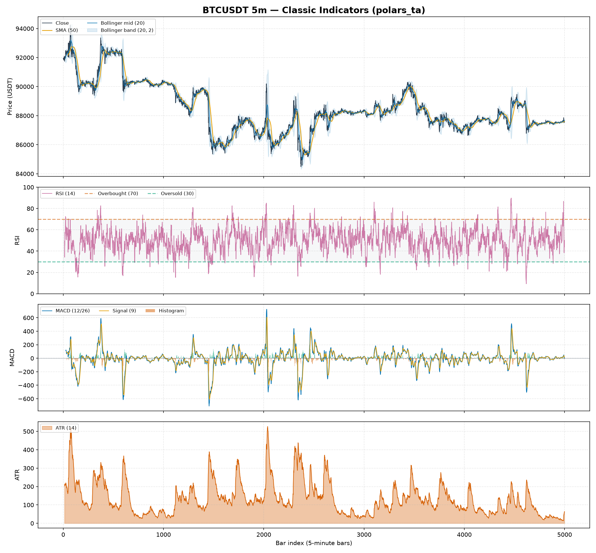
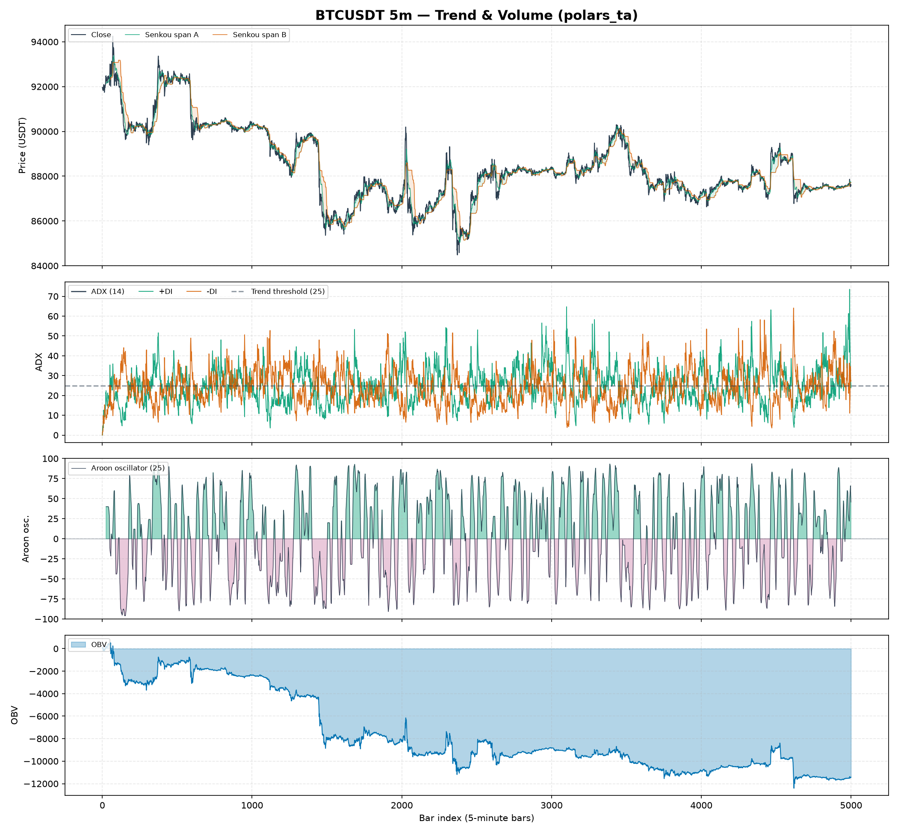
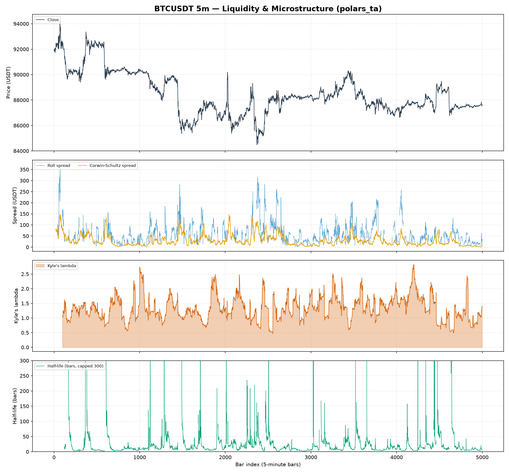
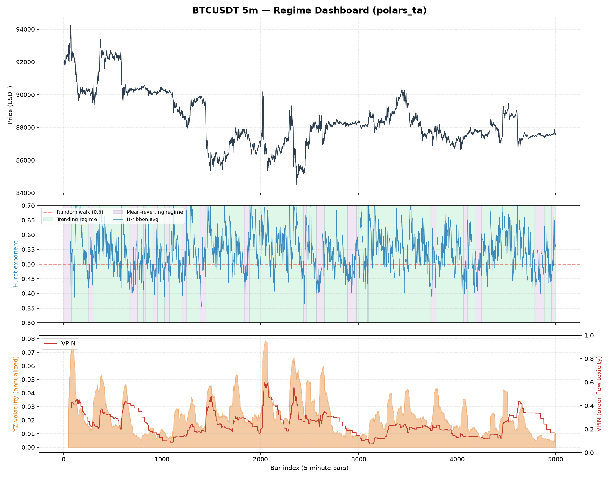

# Examples

!!! tip "Regenerating the figures"
    Every figure on this page is produced by a script in `examples/` and
    committed to `docs/assets/`. Regenerate them all at once with
    `uv run python examples/generate_all_figures.py` after changing an indicator.

## Quickstart: a full indicator bundle

The runnable version of this lives at [`examples/quickstart.py`](https://github.com/Dante-Berth/Polars_TA/blob/main/examples/quickstart.py):

```python
--8<-- "examples/quickstart.py"
```

Run it with:

```bash
uv run python examples/quickstart.py
```

## Classic indicators on real BTCUSDT data

[`examples/plot_classic_indicators.py`](https://github.com/Dante-Berth/Polars_TA/blob/main/examples/plot_classic_indicators.py) plots the well-known retail toolkit — Bollinger Bands, RSI, MACD and ATR — on the same 5,000-bar Binance BTCUSDT 5-minute fixture, so you can see the everyday indicators before the professional-desk ones below.

```bash
uv run python examples/plot_classic_indicators.py
```



### Reading the classic panels

**Panel 1 — Price, Bollinger Bands (20, 2) and a 50-bar SMA.** [`volatility.bollinger_hband`/`bollinger_lband`](api.md#polars_ta.volatility.bollinger_hband) draw the ±2σ envelope around the 20-bar moving average; price tagging or piercing a band flags a stretched move relative to recent volatility. The orange [`trend.sma_indicator`](api.md#polars_ta.trend.sma_indicator) is the slower trend reference.

**Panel 2 — RSI (14).** [`momentum.rsi`](api.md#polars_ta.momentum.rsi) with the conventional 30/70 guides. Excursions above 70 (overbought) and below 30 (oversold) are the classic mean-reversion cues.

**Panel 3 — MACD (12/26/9).** [`trend.macd`](api.md#polars_ta.trend.macd), its signal line, and the histogram ([`macd_diff`](api.md#polars_ta.trend.macd_diff)). Histogram bars are colored by sign *and* positioned above/below zero, so the momentum cross reads without relying on color.

**Panel 4 — ATR (14).** [`volatility.average_true_range`](api.md#polars_ta.volatility.average_true_range), the standard volatility-of-range measure used for stop placement and position sizing.

## Trend & volume toolkit on real BTCUSDT data

[`examples/plot_trend_volume.py`](https://github.com/Dante-Berth/Polars_TA/blob/main/examples/plot_trend_volume.py) plots the trend/volume family on the same fixture.

```bash
uv run python examples/plot_trend_volume.py
```



### Reading the trend & volume panels

**Panel 1 — Price with the Ichimoku cloud.** [`trend.ichimoku_a`/`ichimoku_b`](api.md#polars_ta.trend.ichimoku_a) form the "kumo" cloud; price above the cloud is bullish context, below is bearish, and the cloud is shaded green/red by which span leads.

**Panel 2 — ADX (14) with directional indicators.** [`trend.adx`](api.md#polars_ta.trend.adx) measures trend *strength* (values above the dashed 25 line mark a trending market), while [`adx_pos`/`adx_neg`](api.md#polars_ta.trend.adx_pos) (+DI / -DI) give its direction.

**Panel 3 — Aroon oscillator (25).** The difference of [`aroon_up`](api.md#polars_ta.trend.aroon_up) and [`aroon_down`](api.md#polars_ta.trend.aroon_down), shaded by sign — positive (green) when up-trend momentum dominates, negative (purple) when down-trend does. (The raw up/down lines whip too fast to read over 5,000 bars, so the oscillator is shown instead.)

**Panel 4 — On-Balance Volume.** [`volume.on_balance_volume`](api.md#polars_ta.volume.on_balance_volume) accumulates signed volume; its slope confirms or diverges from price moves.

## Liquidity & microstructure toolkit on real BTCUSDT data

[`examples/plot_liquidity.py`](https://github.com/Dante-Berth/Polars_TA/blob/main/examples/plot_liquidity.py) visualizes the professional-desk liquidity features on the same fixture.

```bash
uv run python examples/plot_liquidity.py
```



### Reading the liquidity panels

**Panel 1 — Price.** Reference for the three microstructure panels below.

**Panel 2 — Spread estimators.** [`microstructure.roll_spread`](api.md#polars_ta.microstructure.roll_spread) (from serial covariance of price changes) versus [`corwin_schultz_spread`](api.md#polars_ta.microstructure.corwin_schultz_spread) (from consecutive high-low ranges), both in USDT — Corwin-Schultz is the smoother, more robust estimate on bar data while Roll is noisier and drops out when its covariance premise fails.

**Panel 3 — Kyle's lambda.** [`microstructure.kyle_lambda`](api.md#polars_ta.microstructure.kyle_lambda) is price impact per unit of signed order flow — higher means thinner, less liquid conditions where a given order moves price more.

**Panel 4 — Half-life of mean reversion.** [`microstructure.half_life`](api.md#polars_ta.microstructure.half_life) from a rolling Ornstein-Uhlenbeck fit: single-digit bars mean fast reversion, and the tall spikes are windows where reversion breaks down and the half-life diverges (the axis is capped at 300 bars so the fast-reverting structure stays legible).

## Professional-desk regime dashboard on real BTCUSDT data

[`examples/plot_regime_dashboard.py`](https://github.com/Dante-Berth/Polars_TA/blob/main/examples/plot_regime_dashboard.py) is a runnable matplotlib example that plots `polars_ta` indicators on **real market data** — a 5,000-row slice of Binance BTCUSDT 5-minute OHLCV bars (`tests/fixtures/btcusdt_5m_sample.arrow`), the same fixture used by `tests/test_quant.py` and `tests/test_microstructure.py`.

```bash
uv run python examples/plot_regime_dashboard.py
```



### Reading the three panels

**Panel 1 — Price.** The raw BTCUSDT close price over the 5,000-bar window, for visual reference against the two panels below.

**Panel 2 — Regime (multi-scale Hurst ribbon).** [`quant.hurst_ribbon("close")`](api.md#polars_ta.quant.hurst_ribbon) computes the Hurst exponent at three window scales (16, 32, 64 bars) and averages them into `h_ribbon_avg`. The chart shades the background **green** where the (smoothed) average sits above 0.5 — a trending/persistent regime where momentum strategies have an edge — and **purple** where it sits below 0.5 — a mean-reverting regime where fading extremes tends to work better. The dashed red line at 0.5 marks the random-walk boundary from the underlying rescaled-range (R/S) theory. Notice how the shading flips back and forth rather than committing to one regime for long stretches — that instability is itself informative: it's a signal that this instrument, at this timeframe, doesn't reward a single fixed strategy family and instead needs regime-adaptive logic (this is exactly why professional desks compute this in real time rather than assuming one regime holds).

**Panel 3 — Volatility and order-flow toxicity.** The orange fill is [`quant.yang_zhang_volatility(...)`](api.md#polars_ta.quant.yang_zhang_volatility), an annualized OHLC volatility estimator that accounts for both overnight gaps and intraday drift (the standard choice on professional vol desks over plain close-to-close historical volatility). The red line is [`microstructure.vpin(...)`](api.md#polars_ta.microstructure.vpin) — Volume-Synchronized Probability of Informed Trading — computed on 500-unit volume buckets, averaged over a rolling window of 20 buckets. VPIN spikes tend to lead or coincide with the sharpest volatility spikes (e.g. around bar ~2050 in the plot above), which is the whole point of the metric: it is a **flow-toxicity** early-warning signal, not a directional one — high VPIN says "informed traders are active and liquidity is thin right now," not "price will go up" or "down."

### Why this example uses real data, not synthetic noise

Every other example and most unit tests in this repo use synthetic random-walk OHLCV data, which is fine for checking that an indicator's math is internally consistent (e.g. RSI stays in `[0, 100]`). But microstructure/regime features like VPIN and the Hurst ribbon are specifically about detecting structure that *isn't* present in i.i.d. random-walk noise — a synthetic series would make the regime panel look meaningless (Hurst hovering uselessly close to 0.5 everywhere, VPIN with no real spikes to speak of). Validating and visualizing them against real BTCUSDT data is what actually demonstrates they work as intended.

## More indicator combinations

### Trend + volatility regime filter

Combine ADX (trend strength) with Bollinger Band width (volatility) to flag "trending and volatile" periods:

```python
from polars_ta import trend, volatility

out = df.with_columns(
    trend.adx("high", "low", "close").alias("adx"),
    volatility.bollinger_wband("close").alias("bb_width"),
).with_columns(
    ((pl.col("adx") > 25) & (pl.col("bb_width") > pl.col("bb_width").rolling_mean(20)))
    .alias("trending_and_volatile")
)
```

### Volume-confirmed momentum

Require both RSI momentum and Money Flow Index (volume-weighted RSI-analogue) to agree:

```python
from polars_ta import momentum, volume

out = df.with_columns(
    momentum.rsi("close").alias("rsi"),
    volume.money_flow_index("high", "low", "close", "volume").alias("mfi"),
).with_columns(
    ((pl.col("rsi") > 70) & (pl.col("mfi") > 80)).alias("overbought_confirmed")
)
```

### Liquidity-aware execution gate

Combine Kyle's lambda (price impact) with VPIN (flow toxicity) to flag conditions where a large order is likely to move the market and get adversely selected — a real pre-trade check used by execution desks before sizing an order:

```python
from polars_ta import microstructure as ms

out = df.with_columns(
    ms.kyle_lambda("close", "volume").alias("kyle_lambda"),
    ms.vpin("close", "volume", bucket_size=500, window=20).alias("vpin"),
).with_columns(
    (
        (pl.col("kyle_lambda") > pl.col("kyle_lambda").rolling_mean(200) * 1.5)
        & (pl.col("vpin") > 0.4)
    ).alias("thin_and_toxic")
)
```
